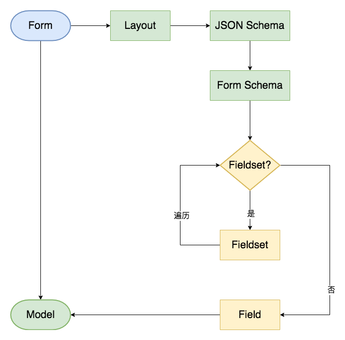

# 介绍

基于 JSON Schema 的表单自动化解决方案。

## 为什么要做这个
在中后台系统中，表单是业务的核心展示形式之一。

对于使用 Element UI 库的项目来说，由于 el-form 实现不够完善，为了完成一个复杂表单的开发，开发者往往要写很多重复的代码。再者，由于没有一套统一开发范式，不同开发者的实现可能差别非常大，导致维护成本增加。

基于在表单开发中面临的各种问题，经过不断的探索与尝试，总结出了一套表单自动化解决方案 el-schema-form。

el-schema-form 是基于 JSON Schema、Element-UI 封装的表单组件，目的是帮助开发者更高效的开发出更容易维护的表单。

## 核心设计
- 基于 JSON Schema 协议
	- 可配置化生成表单
	- 可复用性、可扩展性强
- 支持各种复杂的表单布局
- 支持可视化构建表单
- 支持扩展自定义组件
- 支持控件组嵌套以应付各种复杂场景

## 收益
- 减少重复劳动，提升开发效率
- 统一的开发标准，降低维护成本
- 统一的 JSON 协议方便应对各种需求，如动态输出表单、可视化搭建表单

## 为什么选用 JSON Schema
- 需要一套通用协议描述表单，选用现有的成熟方案是更合适的选择
- 标准化，方便复用扩展，减少上手成本

### JSON Schema 的问题

由于 JSON Schema 是用来描述数据的，并不能很完善的描述表单，如：

- 类型有限（表单元素类型 > 数据类型）
- 无法描述布局
- 无法描述表单属性，如 placeholder
- ……

基于以上问题，需要对 JSON Schema 进行扩展，以便让其既能描述数据也可以描述 UI，扩展后的配置称之为 Form Schema。扩展的内容有：

- 表单模式（禁用/只读）
- 排序
- 新增
- 删除
- 表单属性
- ……

## 技术架构

### 为什么把 Schema/Layout 的配置分开
配置互不干扰，各自做好自己的事情，简单直观。当需要调整顺序或控件组状态或位置时，布局的配置调整起来也相对容易。

布局可以看作一棵树，fieldset 相当于枝干，field 可以看作是叶子。如果布局树需要描述叶子的细节，那么配置会过于复杂。
